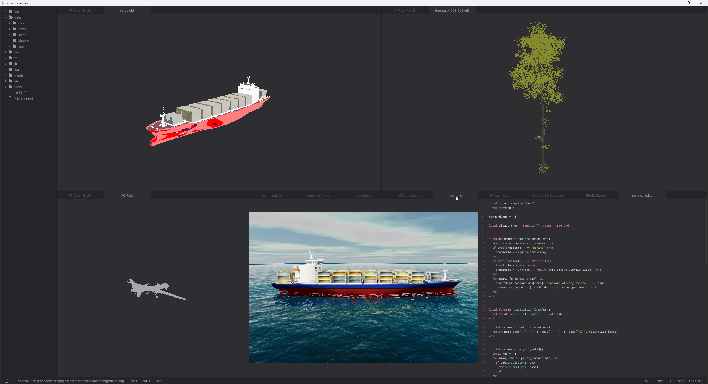
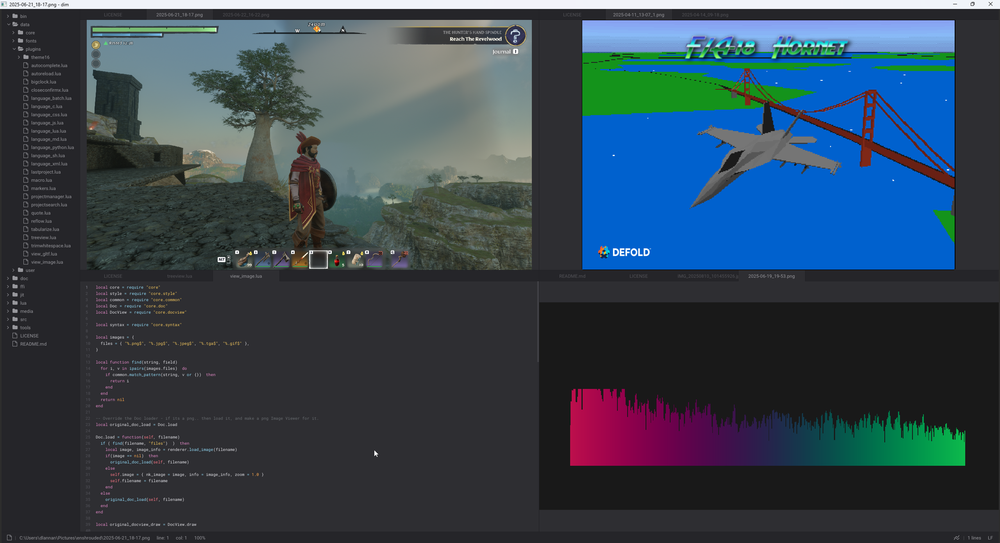

# dim
not so lite 

A lite based text editor running from sokol-luajit + nuklear.

[ 30-10-2025 Updates ]:

The 3D viewer is almost done. A basic 3D rendering system has been added (a 3D engine of sorts).

I expect to have some nice features for this:
- Selectable "up axis" for different model spaces.
- Information on the model (tris/polys, materials, texture counts)
- Ability to manually zoom and spin on the Up axis. 
- Maybe a PBR shader to support some nice rendering. 

I still need to fix:
- Texture coord mapping
- Color component on colored only polys
- Alpha transparency and cut-out.

Overall very happy with progress. Will finish up the 3D viewer sections in the next couple of days and move onto framework/project management tools and build tools.

[ 23-10-2025 Updates already ]:

- Its working. Most (if not all?) of lite's operations are working. Theres a couple of system calls that result in "File Not Found" in the console - this is due to .. and . being included in the file list. Will fix. 
- Added an image view plugin (see pic below)
- Adding a gltf 3D viewer as well - this will be needed for Thunc.
- Added an image interface to renderer (load and draw - will add save maybe. Not sure I want image editing). 

More features/plugins incoming - a lua debugger, a project workspace (think like vscode ish), extension/plugin handling (able to enable/disable in workspace), some embedding features needed for Thunc.

Id also like to make a git integration but higher level. Where the versioning and control of it is more decoupled and easier for people to use - ie no knowledge of git would be needed. And it would handle art assets, code and binaries very differently (think AlienBrain if you have ever used that :) )

Again. Cant thank rxi enough. This is an utterly powerful tool. I will be sending you some sponsorship rxi!

## Lite

This project would not exist without lite:

https://github.com/rxi/lite/tree/master

Lite is a brilliant simple lightweight text editor written in lua. And supports plugins and more.

Checkout the plugins here. Most work with dim (with minor adjustments).

https://github.com/rxi/lite-plugins

Being written in Lua it means that it can work with sokol-luajit that I have put together. The benefits here means there is nothing to build (unless you want to pack it into a simple bundle :) ) and the platforms can be varied - It should initially work on Win, OSX and Linux without too many problems.

I also expect it should be able to be built for Android and IOS as well with some extra work (Testing and lib building might be needed)

If you want the builds for the sokol-luajit system. They can be found here:

https://github.com/dlannan/sokol-build/

Note: There are slight variances in these versions vs the original sokol (like being able to disable clear on a new_frame) but they should be highly compatible. As sokol is improved or bug fixes added I will try to keep this relatively closely sync'd.

The intended use for this will be in the sokol-luajit editor (Thunc). It will allow the easy editing, loading, saving of game engine scripts. Debugging should also be able to be added (future goal).

## Sokol-luajit 

A luajit + ffi + sokol + nuklear + (some other nice libs) framework providing a rapid development framework for making applications, games or in my case sims.

https://github/dlannan/sokol-luajit/

This is all MIT. Use however you would like. I have a discord that is not very busy :) but if you want to communicate its there.

I have a number of applications being developed with this framework (including dim). Many are in my repositories. I hope to be making simulation games with the framework in 2026 - main recreations of M1A1 Tank Platoon, F16 Combat Pilot, F15 Strike Eagle and some others. 

My initial F18 Interceptor homage can be played here (its in production atm with release date now looking like Jan 2026).

https://bukkat.itch.io/f18

The code for this will be use in future games made with Thunc (all luajit).