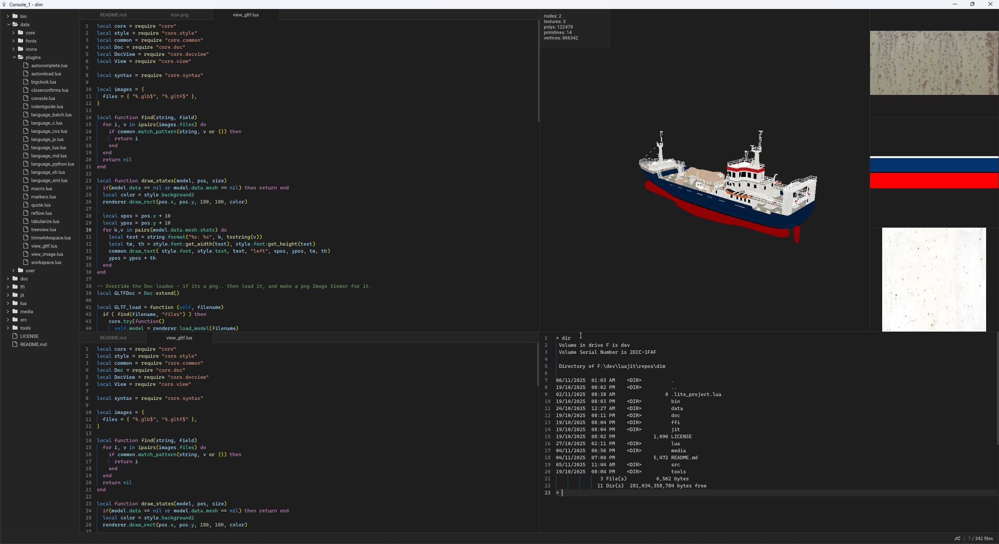
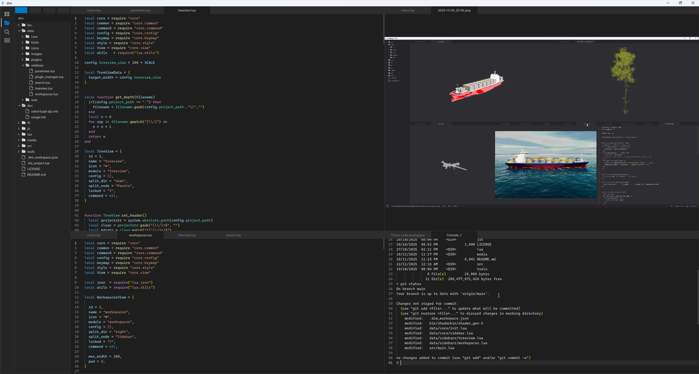
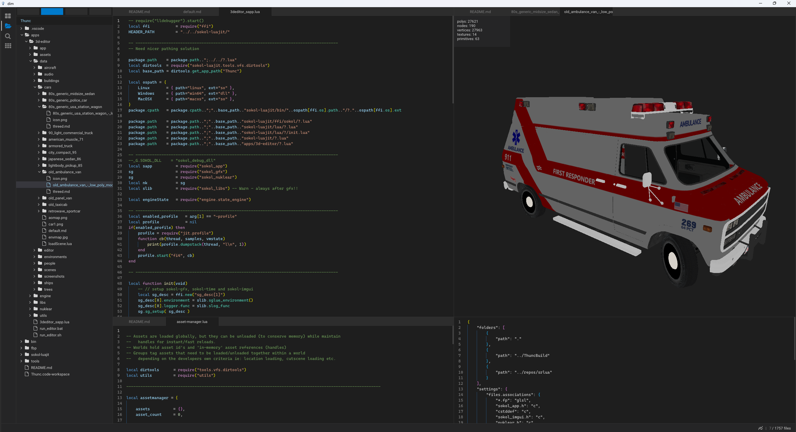
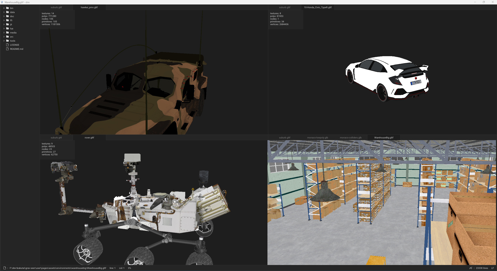
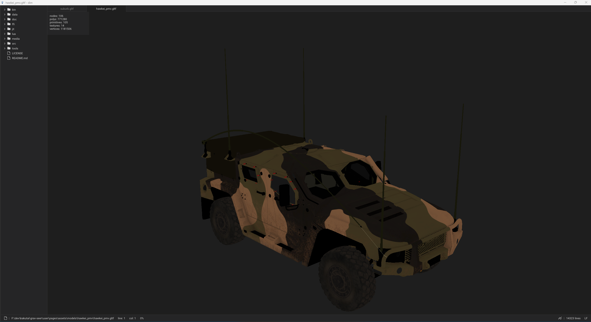
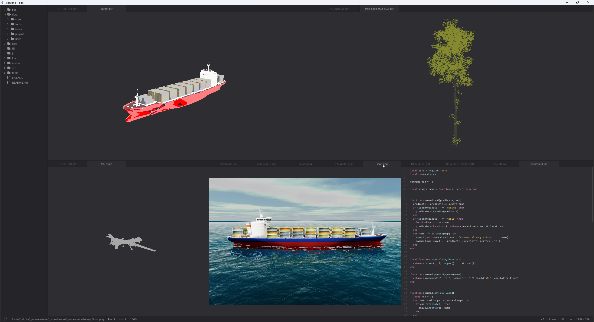
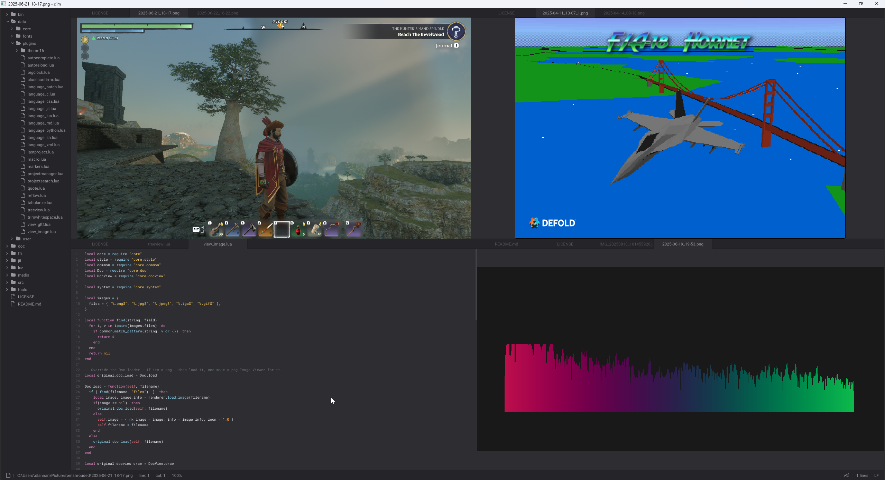

# dim
not so lite

A lite based text editor running from sokol-luajit + nuklear.

To run Win:

``` ./bin/win64/luajit.exe ./src/main.lua```

To run Linux:

``` ./bin/linux/luajit ./src/main.lua```

A release build will be made in the future once workspaces and plugin management is complete.

Lite links:

Lite: https://github.com/rxi/lite/

Plugins: https://github.com/rxi/lite-plugins

Color Themes: https://github.com/rxi/lite-colors


 (Note Dim has its own VSCode color theme that you can use in Lite or Lite XL).


[ 22-11-2025 Updates ]:

So many updates. Lots of messy things updated, ready for multi-proc and other features:
- OO removal is mostly done. The code will move to a more array based object management.
- Workspaces initial proto working. Can switch between spaces. Need to add in json atm. Adding widgets for ui. The reload/switching is working well. 
- Many many many little bug fixes and improvements (esp with OO changes). Expect to see more bugs. Will start adding some tests ones all the objects are "arrayified". Should be fairly simple to do. 
- Panels and Sidebar is now a separate system. It is easy to add a new sidebar. These exist in the sidebar panels object. See sidebar examples (mainly treeview) for reference.

TODO:
- Finish plugins manager.
- Add search in files tool (will be like VSCode)
- Make some sample multi-proc tests.

## Multi-proc details

The views will be designed to run a separate process and the view is rendered to a renderTexture.
The output is passed to the main editor for display (clipped and layered by the editor). The aim will be to have this work for text and graphical output. 

Standalone runners can actually work without the editor - A game or app devleoper can literally make their app/game as a runner, test in editor, then detach and build as a standalone app. This capability is mostly already available in Thunc (my private engine) but I will be making a cut-down version for Dim. 

## Workspaces

Dim workspace:


Thunc workspace:


Just press the blue workspace button at the top to switch.

[ 12-11-2025 Updates ]:

Mostly working on workspaces, sidebar and focus implementation:
- Added a focus for views. Its not pretty and will be redone. Need to separate active and focus.
- More improvements in organization of panels (for sidebar)
- Improved sidebar operation (will be able to animate panels)

Lots to do here. Kinda boring backend arch. Aim is to make things more referential - the lite system is too OO and will cause many problems in the future, so it needs to be done.

[ 07-11-2025 Updates ]:

Some cross platform testing and more:
- Linux tested and working now (3D and Image plugins as well)
- Added initial sidebar
- Added FontAwesome 3 (its open source and free to use)
- Added a platform file as I support more platforms this will fill up.

TODO:
- Finish workspaces
- Add plugin manager
- Complete binning for 3D - I may move it to texture rendering multi-proc. will see.

[ 04-11-2025 Updates ]:

More updates. Mostly about new underlying rendering engine.
- Added zoom feature for 3d plugin
- Reworked 3D rendering. Using more specific geometry blocks (soon to be bin organized)
- Many fixes in fonts, tabs, and some tweaks to init and config.
- Expanded lua language plugin. Now has some more highlighting (much closer to vscode)
- Started building my own console. Works but beware in progress!! :)

Next Up:
- Workspaces, plugin manager and finish binning for 3D viewer.



[ 31-10-2025 Updates ]:

Updates coming quickly now:
- Fixed node transform calcs. All looking good now.
- Updated alpha modes (blend and cutoff working well) - will need alpha sorting (coming soon...)
- Tested some really big scenes (see below - 2.7 mill polys 27 mill verts - not sure the verts number is right)
- Many complex objects tested well (see hawkei truck below)
- Many bugs fixed with the cgltf loader.

TODO:
- Rework the render engine to use my bin system (will allow sorting and ordering as well as priority)
- Add in some better entity management (to be used in Thunc).




[ 30-10-2025 Updates ]:

The 3D viewer is mostly working! A basic 3D rendering system has been added (a 3D engine of sorts).


I expect to have some nice features for this:
- Selectable "up axis" for different model spaces.
- Information on the model (tris/polys, materials, texture counts)
- Ability to manually zoom and spin on the Up axis.
- Maybe a PBR shader to support some nice rendering.

I still need to fix:
- [x] Texture coord mapping  - fixed!
- [x] Color component on colored only polys - working on now
- [x] Alpha transparency and cut-out. - working on now

Overall very happy with progress. Will finish up the 3D viewer sections in the next couple of days and move onto framework/project management tools and build tools.

[ 23-10-2025 Updates already ]:

- Its working. Most (if not all?) of lite's operations are working. Theres a couple of system calls that result in "File Not Found" in the console - this is due to .. and . being included in the file list. Will fix.
- Added an image view plugin (see pic below)
- Adding a gltf 3D viewer as well - this will be needed for Thunc.
- Added an image interface to renderer (load and draw - will add save maybe. Not sure I want image editing).



More features/plugins incoming - a lua debugger, a project workspace (think like vscode ish), extension/plugin handling (able to enable/disable in workspace), some embedding features needed for Thunc.

Id also like to make a git integration but higher level. Where the versioning and control of it is more decoupled and easier for people to use - ie no knowledge of git would be needed. And it would handle art assets, code and binaries very differently (think AlienBrain if you have ever used that :) )

Again. Cant thank rxi enough. This is an utterly powerful tool. I will be sending you some sponsorship rxi!

## Lite

This project would not exist without lite:

https://github.com/rxi/lite/tree/master

Lite is a brilliant simple lightweight text editor written in lua. And supports plugins and more.

Checkout the plugins here. Most work with dim (with minor adjustments).

https://github.com/rxi/lite-plugins

Being written in Lua it means that it can work with sokol-luajit that I have put together. The benefits here means there is nothing to build (unless you want to pack it into a simple bundle :) ) and the platforms can be varied - It should initially work on Win, OSX and Linux without too many problems.

I also expect it should be able to be built for Android and IOS as well with some extra work (Testing and lib building might be needed)

If you want the builds for the sokol-luajit system. They can be found here:

https://github.com/dlannan/sokol-build/

Note: There are slight variances in these versions vs the original sokol (like being able to disable clear on a new_frame) but they should be highly compatible. As sokol is improved or bug fixes added I will try to keep this relatively closely sync'd.

The intended use for this will be in the sokol-luajit editor (Thunc). It will allow the easy editing, loading, saving of game engine scripts. Debugging should also be able to be added (future goal).

## Sokol-luajit

A luajit + ffi + sokol + nuklear + (some other nice libs) framework providing a rapid development framework for making applications, games or in my case sims.

https://github/dlannan/sokol-luajit/

This is all MIT. Use however you would like. I have a discord that is not very busy :) but if you want to communicate its there.

I have a number of applications being developed with this framework (including dim). Many are in my repositories. I hope to be making simulation games with the framework in 2026 - main recreations of M1A1 Tank Platoon, F16 Combat Pilot, F15 Strike Eagle and some others.

My initial F18 Interceptor homage can be played here (its in production atm with release date now looking like Jan 2026).

https://bukkat.itch.io/f18

The code for this will be use in future games made with Thunc (all luajit).
